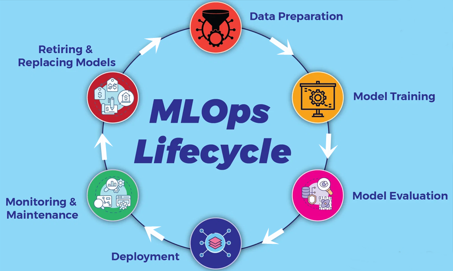

# WaterFlow
## Projet de Prédiction de la Potabilité de l'Eau 🌊

Bienvenue dans ce projet innovant où la science des données rencontre une problématique cruciale : la qualité de l'eau.

 Inspiré par l'univers de One Piece et le thème <b>Water7</b>, nous avons développé un modèle prédictif pour évaluer la potabilité de l'eau, en hommage à la célèbre cité aquatique de l'œuvre d'Eiichiro Oda.


## Documentation - Veille scientifique

### MLOps

Le <b>MLOps</b> est une pratique qui suit le cycle de vie d'un algorithme de machine learning, à savoir la préparation des données, son developpement, son déploiement puis son monitoring.
Tout ceci vise à garantir la réutilisation du modèle sur plusieurs cycles de vie.



### MLflow

MLflow est une plateforme open source qui permet de gérer le cycle de vie des modèles de Machine Learning.

En particulier, grâce à MLflow, les modèles qui ont été entraînés à une date spécifique ainsi que les hyper-paramètres associés pourront être stockés, monitorés et réutilisés de manière efficace.


# Usage

**Data analysis**

Exécuter les chunks du fichier "datanalysis.ipynb".

Pour lancer les experiences mlflow,et avoir les modeles au format pickle

```
mlflow ui --port 5000
```

**Data Viz**

Un dashboard PowerBI a été réalisé. Voir: dashboard.pdf/dashboard.pbix

**Unittest**

Pour faire des tests:

```
cd waterflow\app
python -m unittest test_app -v
```
**Run app**

Pour lancer l'application Flask en local:

```
pip install -r requirements.txt
python app.py
```


# Authors

Aimen CHERIF

Amina SADIO

Anthony SAINT-JEAN